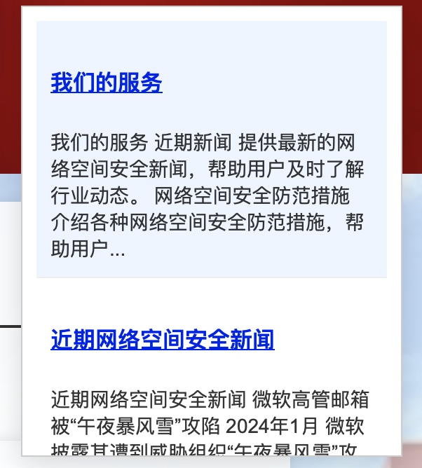
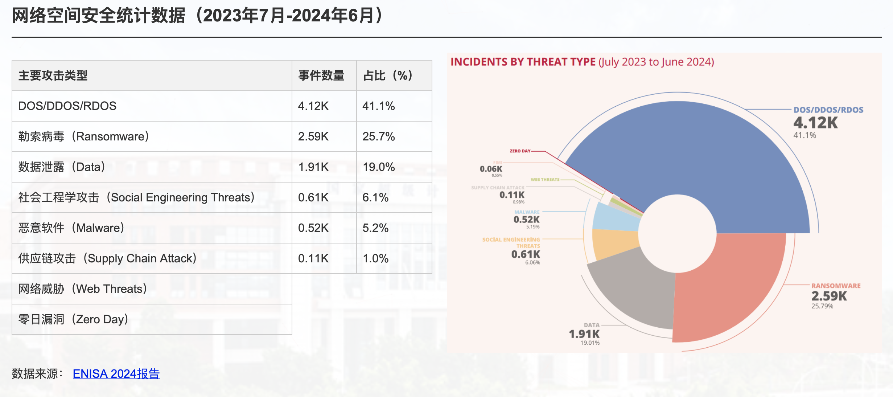
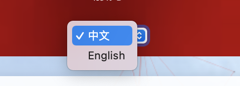

# 🌐 public-class-webdesign

## 项目简介

🚀 **静态网页设计 | HTML + CSS + JavaScript**

本项目是一个基于 **HTML、CSS 和 JavaScript** 的静态网页，提供多个功能模块，如 **搜索、统计信息展示、表单提交、蜘蛛网点击特效等**，提升用户的交互体验。🎨✨

---

## 📌 项目特点

- ✅ **主页**：全屏背景 + 半透明遮罩 + 渐变叠加
- ✅ **搜索功能**：关键词匹配 + 结果高亮 + 点击跳转
- ✅ **统计信息展示**：表格布局 + 响应式调整 + 可选 logo
- ✅ **表单提交**：留言表单 + 验证提示 + 交互反馈
- ✅ **蜘蛛网点击特效**：HTML5 Canvas 实现酷炫效果
- ✅ **多语言切换**：支持中英文，自动记忆用户选择
- ✅ **评论/点赞功能**：可输入评论 + 记录点赞数
- ✅ **回到顶部按钮**：平滑滚动，优化用户体验

---

## 🔧 运行方法

1. **下载或克隆项目**

   ```sh
   git clone https://github.com/z-zanez/public-class-webdesign.git
   ```
2. **进入项目目录**

   ```sh
   cd website
   ```
3. **运行网页**

   - 直接打开 `index.html` 文件，即可访问网站。🎉

---

## 🎨 功能展示

### 🏠 1. 主页

- 🖼️ **背景图片**：全屏覆盖，提供良好的视觉体验。
- 🎨 **渐变效果**：`linear-gradient` 透明叠加，使背景更清晰可读。

### 🔍 2. 搜索功能

- 🔹 点击 **搜索图标** 展开搜索框。
- 🔹 输入关键词后，系统匹配 **高亮显示** 相关内容。
- 🔹 可点击搜索结果跳转到对应位置。



### 📊 3. 统计信息展示

- 📌 **表格显示数据**，支持 **响应式布局**。
- 📌 可选 **stat-logo**，增强视觉表现力。



### 📝 4. 表单提交

- 🖊️ 提供 **留言表单**，用户填写 **姓名、邮箱、留言内容**。
- ✅ 通过 JavaScript 进行 **数据验证**。
- 📢 提交后 **弹窗提示结果**。

### 🕸️ 5. 蜘蛛网点击特效

- ✨ 页面背景 **随鼠标移动** 生成 **动态蜘蛛网特效**。
- 🎨 使用 **HTML5 Canvas** 绘制，打造炫酷交互。


### 🌍 6. 多语言切换

- 🗣️ 支持 **中文 & 英文**，可通过 **下拉菜单** 选择语言。
- 💾 **自动记忆** 用户选择，优化体验。



### 💬 7. 评论/点赞功能

- 📝 用户可输入评论，内容实时显示。
- 👍 点赞功能可记录用户点赞次数，数据实时更新。

### 🔝 8. 回到顶部按钮

- 🔺 页面滚动到一定高度后，**回到顶部按钮** 自动出现。
- 🎯 **点击即可平滑返回** 页面顶端。

---

## 📂 代码结构

```plaintext
project/
│── index.html          # 主页面
│── styles.css          # 样式文件
│── script.js           # JavaScript 交互逻辑
│── images/             # 存放图片资源
│── README.md           # 项目说明文档
```

### 🎨 `styles.css` - 主要样式

- 🖌️ `body`：全局背景 & 字体设置。
- 🎭 `header`：顶部导航栏样式。
- 🔍 `.search-container`：搜索栏样式与定位。
- 📊 `.stat-container`：统计信息区域的布局。

### 💻 `script.js` - 主要功能

- 🕸️ **蛛网点击特效**：使用 HTML5 Canvas 实现动态背景。
- 🔍 **搜索功能**：监听搜索框输入，高亮匹配内容。
- 📝 **表单提交**：监听留言表单，提供前端验证。

---

📢 **欢迎 Star & Fork，期待你的反馈！✨**
